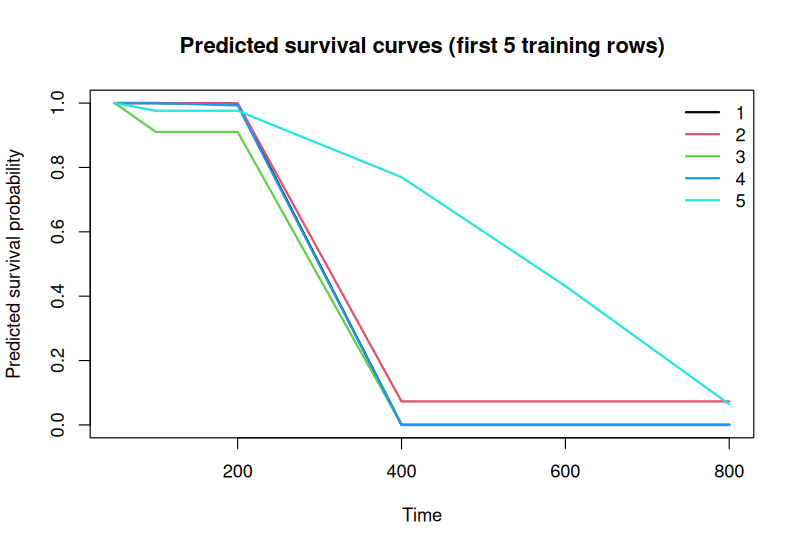
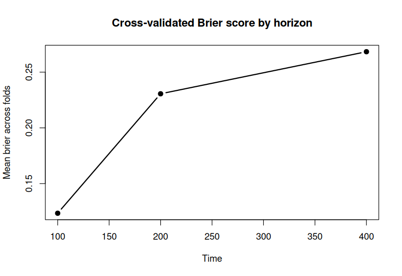
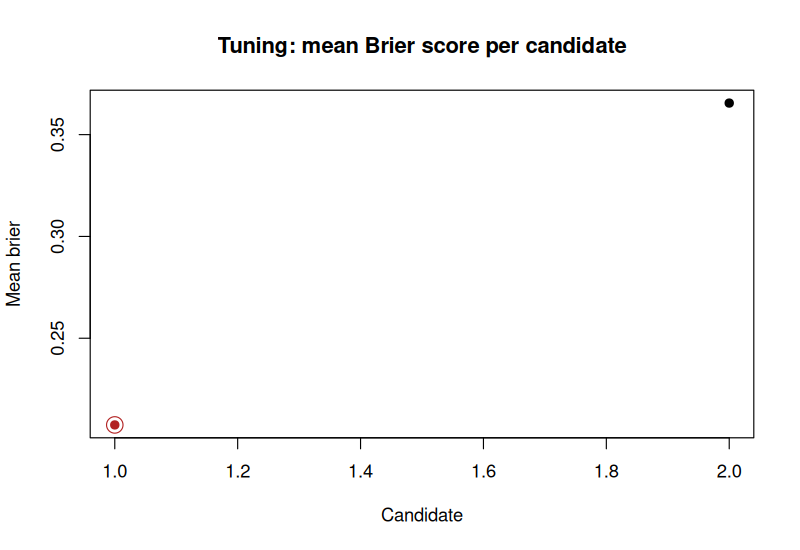
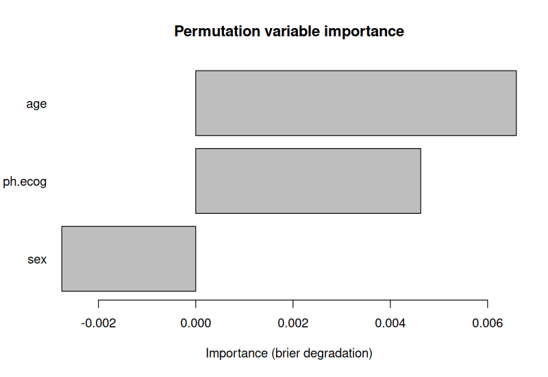

# nbsurv

<!-- badges: start -->
[](https://github.com/ielbadisy/nbsurv/actions/workflows/R-CMD-check.yaml)
[](https://www.gnu.org/licenses/gpl-3.0)
<!-- badges: end -->

`nbsurv` fits conditional naive Bayes survival models for right-censored
time-to-event data. The package focuses on horizon-specific survival
prediction with inverse-probability of censoring weighting, and includes
tools for model fitting, prediction, evaluation, cross-validation,
hyper-parameter tuning, and permutation variable importance.

All results below are real output from `lung` (from the `survival` package,
rows with missing predictors dropped).

## Main workflow

```r
library(nbsurv)
library(survival)

lung <- na.omit(lung)
lung$status <- as.integer(lung$status == 2)

fit <- nbsurv(
  Surv(time, status) ~ age + sex + ph.ecog,
  data = lung
)

surv_prob <- predict(fit, newdata = lung[1:5, ], times = c(100, 200, 400))
round(surv_prob, 3)
#>   t_100 t_200 t_400
#> 1 0.839 0.717 0.449
#> 2 0.919 0.708 0.381
#> 3 0.747 0.427 0.252
#> 4 0.801 0.692 0.405
#> 5 0.676 0.534 0.275

event_prob <- predict(fit, newdata = lung[1:5, ], times = c(100, 200, 400), type = "event")
round(event_prob, 3)
#>   t_100 t_200 t_400
#> 1 0.161 0.283 0.551
#> 2 0.081 0.292 0.619
#> 3 0.253 0.573 0.748
#> 4 0.199 0.308 0.595
#> 5 0.324 0.466 0.725

plot(fit, times = c(50, 100, 200, 400, 600, 800))
```



## Evaluation

```r
metrics <- evaluate_nbsurv(
  fit,
  newdata = lung,
  times = c(100, 200, 400)
)

metrics
#>   time     brier concordance
#> 1  100 0.1249025   0.5176070
#> 2  200 0.2299579   0.5055850
#> 3  400 0.2454511   0.4982014
```

`evaluate_nbsurv()` currently returns:

- IPCW Brier score
- Concordance

for each requested prediction horizon.

## Cross-validation

```r
cv_fit <- cv_nbsurv(
  Surv(time, status) ~ age + sex + ph.ecog,
  data = lung,
  folds = 3,
  times = c(100, 200, 400),
  seed = 1
)

cv_fit$summary
#>   time     brier concordance
#> 1  100 0.1233948   0.5029725
#> 2  200 0.2305867   0.4899689
#> 3  400 0.2683234   0.4907712

plot(cv_fit)
```



## Hyper-parameter tuning

```r
grid <- data.frame(
  scale = c(TRUE, FALSE),
  laplace = c(1, 2),
  min_sd = c(0.05, 0.10)
)
grid$time_grid <- I(list(NULL, NULL))

tuned <- tune_nbsurv(
  Surv(time, status) ~ age + sex + ph.ecog,
  data = lung,
  param_grid = grid,
  folds = 3,
  times = c(100, 200, 400),
  seed = 1
)

tuned$best_params
#>   scale laplace min_sd time_grid mean_metric
#> 1  TRUE       1   0.05              0.207435

plot(tuned)
```



## Variable importance

```r
vi <- varimp_nbsurv(
  fit,
  newdata = lung,
  times = c(100, 200, 400),
  n_repeats = 10,
  seed = 1
)

vi
#> nbsurv permutation variable importance
#> Metric: brier | repeats: 10
#>
#>  feature  baseline  permuted   importance
#>      age 0.2001038 0.2066950  0.006591213
#>  ph.ecog 0.2001038 0.2047293  0.004625528
#>      sex 0.2001038 0.1973498 -0.002753981

plot(vi)
```



`age` and `ph.ecog` degrade the Brier score the most when permuted (most
important); `sex` slightly *improves* it when shuffled here, i.e. it
contributes essentially nothing beyond noise on this fit/horizon set.

`calibration_plot_nbsurv(fit, newdata = lung, horizon = 200)` is also
available for visual calibration assessment at a single horizon.

## Benchmark vs. `coxph`

A quick, honest comparison against `survival::coxph()` on the same formula:
20 random 70/30 train/test splits of `lung`, IPCW Brier score and
concordance computed identically for both models (`nbsurv`'s own internal
metric functions, applied to `coxph`'s linear predictor and
`survfit()`-derived survival probabilities too), means reported below.

```r
#>   time nb_brier cox_brier nb_conc cox_conc
#> 1  100   0.1312    0.1304  0.6011   0.6294
#> 2  200   0.2051    0.1950  0.6107   0.6294
#> 3  400   0.2397    0.2344  0.5792   0.6294
```

`coxph` edges out `nbsurv` on both metrics at every horizon on this
dataset - expected: `age + sex + ph.ecog` have a roughly log-linear,
non-interacting effect on the hazard here, which is exactly what a
correctly-specified Cox model is built for, while `nbsurv`'s
conditional-independence assumption between predictors costs it some
accuracy in exchange for a much simpler, distribution-light estimation
procedure. The gap is real but small (concordance within ~0.03-0.05,
Brier within ~0.01-0.05).

## Notes

- `predict()` returns monotone survival curves by applying a cumulative minimum
  across increasing horizons.
- Continuous predictors are modeled with Gaussian class-conditional densities.
- Categorical predictors use Laplace-smoothed probabilities.
- The package exposes a single clean public API centered on `nbsurv()`,
  `predict()`, `evaluate_nbsurv()`, `cv_nbsurv()`, `tune_nbsurv()`, and
  `varimp_nbsurv()`.
